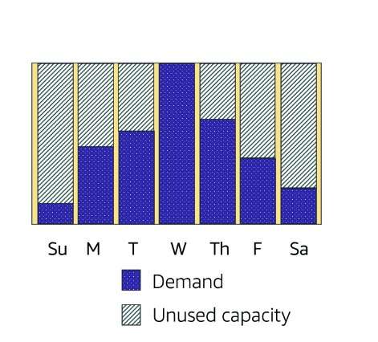

# EC2 Scaling

## *What is Scalability ?*
> Scalability involves beginning with only the resources you need and designing architecture to automatically respond to changing demand by scaling it out. The result is you only pay for what you used, without worrying about lack of computing capacity demand

## **Amazon EC2 Auto Scaling**

*Amazon EC2 Auto Scaling is a service that automatically manages the number of Amazon EC2 instances in a group. By automatically scaling your instance, you are able to maintain a greater sense of application availability*

There are 2 approaches to scaling:
- Dynamic scaling
  > responds to changing demand
- Predictive scaling
  > automatically schedules the right number of instances based on predicted demand

***You can use both dynamic scaling and predefined scaling together***